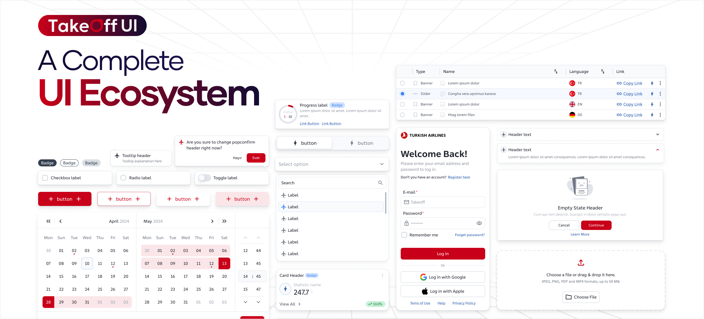

# @takeoff-ui/core

Core **Stencil.js Web Components** for TakeOff UI. Standards-based, framework-agnostic components that run anywhere, with first-class bindings for **React**, **Vue**, and **Angular**.

[](https://www.npmjs.com/package/@takeoff-ui/core)
[](https://www.npmjs.com/package/@takeoff-ui/core)
[](./LICENSE)

<!-- Use an absolute URL so it renders on npm -->
<p align="center">
  
</p>

## Documentation
Full guides, API, and examples:  
https://takeoff-ui-blond.vercel.app/docs/Introduction

## Installation
```bash
npm i @takeoff-ui/core
# optional framework bindings
npm i @takeoff-ui/react @takeoff-ui/vue @takeoff-ui/angular